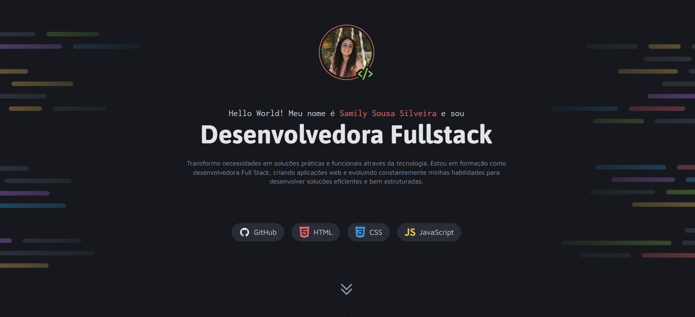

# Portfólio Dev — Samily Sousa

Projeto de portfólio pessoal desenvolvido com foco em apresentar meus projetos, habilidades e formas de contato.

---

# Tecnologias utilizadas

* HTML5
* CSS3
* Flexbox e Grid
* Responsividade

---

# Layout

O design foi baseado em um layout do Figma, com foco em uma interface moderna, organizada e visualmente agradável.

---

# Funcionalidades

* Seção de apresentação (hero)
* Listagem de projetos com links para acesso
* Seção de serviços
* Área de contato com links para redes sociais
* Efeito de hover e interações visuais

---

# Acesse o projeto

👉 [Ver projeto online](https://samily-sil.github.io/Portf-lio-Dev/)

---

# Preview

<!-- imagem -->

---

# Contato

* LinkedIn: https://www.linkedin.com/in/samily-sousa-919352362
* GitHub: https://github.com/Samily-sil
* Email: [samily.sss2005@gmail.com](mailto:samily.sss2005@gmail.com)

---

# Sobre mim

Sou estudante de desenvolvimento Fullstack, em transição de carreira para a área de tecnologia, com foco em desenvolvimento web. Busco minha primeira oportunidade para aplicar e evoluir minhas habilidades.

---
